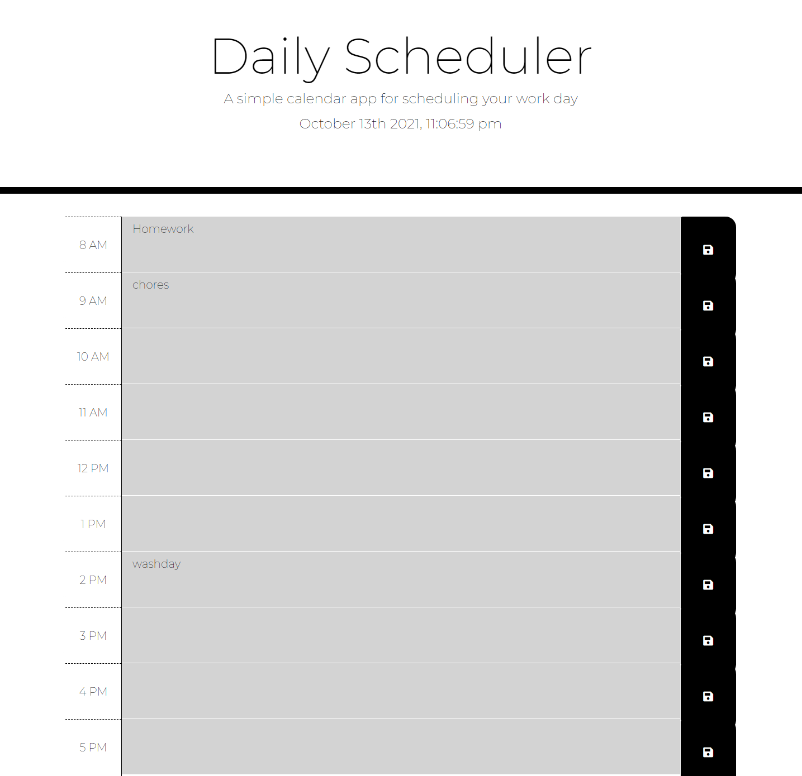

# Daily Work Scheduler Project

## Description 

A daily task reminder or daily events planner is vital for an ever-evolving day, so having an efficient mode of scheduling in tasks or reminders to keep your priorities in check is a must. This is where the Daily Work scheduler provides an alternative way to keep track of the work tasks and key priorities with a unique simplistically designed interface that guides the user throughout the webapp seamlessly. 

Through this initiative, the key understanding of moments API was implemented and utilized to establish a functioning scheduler that operates on the current time and date of the user is based. 

 
## Table of Contents - Daily Work Scheduler - Project

- [Project](#Project)
- [Website](#Website)
- [License](#license)
- [Contribute](#contribute)

## Project
The following screenshot showcases the Daily Work Scheduler and its functioning user interface. 



## Website

To access the webapp of the Daily Work Scheduler, please click on the following link: 
https://gurtej154.github.io/KeyGen-project/

## License
Copyright (c) 2021 Gurtej Singh

Permission is hereby granted, free of charge, to any person obtaining a copy of this software and associated documentation files (the "Software"), to deal in the Software without restriction, including without limitation the rights to use, copy, modify, merge, publish, distribute, sublicense, and/or sell copies of the Software, and to permit persons to whom the Software is furnished to do so, subject to the following conditions:

The above copyright notice and this permission notice shall be included in all copies or substantial portions of the Software.

THE SOFTWARE IS PROVIDED "AS IS", WITHOUT WARRANTY OF ANY KIND, EXPRESS OR IMPLIED, INCLUDING BUT NOT LIMITED TO THE WARRANTIES OF MERCHANTABILITY, FITNESS FOR A PARTICULAR PURPOSE AND NONINFRINGEMENT. IN NO EVENT SHALL THE AUTHORS OR COPYRIGHT HOLDERS BE LIABLE FOR ANY CLAIM, DAMAGES OR OTHER LIABILITY, WHETHER IN AN ACTION OF CONTRACT, TORT OR OTHERWISE, ARISING FROM, OUT OF OR IN CONNECTION WITH THE SOFTWARE OR THE USE OR OTHER DEALINGS IN THE SOFTWARE.

## How to Contribute
To contribute, modify or edit in general; 
- Open Visual Studio Code
- Open or create a new project folder 
- Open a integrated terminal or git bash 
- Attain the repo link from this repository


```
HTTPS
https://github.com/gurtej154/Daily-Scheduler-Project.git

or

SSH
git@github.com:gurtej154/Daily-Scheduler-Project.git
```
- Enter git clone 
```
HTTPS
 git clone https://github.com/gurtej154/Daily-Scheduler-Project.git

or

SSH
git clone git@github.com:gurtej154/Daily-Scheduler-Project.git
```
- Start accessing the project's content!
